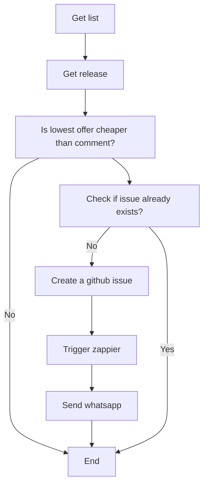

# Discogs Price Alert App

## Overview
This Next.js application monitors a specified list of releases on Discogs. When the price of a release drops below a predetermined threshold, it triggers a series of actions that culminates in sending a notification via WhatsApp. This allows users to keep track of price drops on desired records without having to manually check the site.

### How It Works
The application follows this workflow:
- Fetches a list of releases from a specified Discogs list.
- Checks if the lowest offer for each release is cheaper than the price specified in the comments.
- If the offer is cheaper and no related GitHub issue exists, it creates an issue.
- Triggers a Zapier workflow that sends a notification to a WhatsApp number.



### Key Features
- **Discogs Integration:** Fetches release data directly from Discogs.
- **Price Monitoring:** Automatically monitors and compares release prices.
- **GitHub Issue Tracking:** Creates issues for tracking price drops.
- **WhatsApp Notifications:** Sends alerts via WhatsApp for immediate notification.

## Setup

### Prerequisites
- Node.js installed on your local machine.
- A Vercel account for deployment.
- A GitHub account for issue tracking.
- A Zapier account to set up the WhatsApp notification workflow.
- A Twilio account with WhatsApp sandbox configured for sending messages.

### Installation
1. **Clone the Repository**
   ```
   git clone https://github.com/yourusername/discogs-price-alert-app.git
   cd discogs-price-alert-app
   ```

2. **Install Dependencies**
   ```
   npm install
   ```

3. **Configure Environment Variables**
   Rename `.env.example` to `.env` and update it with your credentials for Discogs, GitHub, Zapier, and Twilio.

### Whatsapp message 
I use zapier to send messages


### Running Locally
```
npm run dev
```

### Deployment
Deploy the application to Vercel using the Vercel CLI or through the Vercel GitHub integration for automatic deployments.

## Usage
- **Monitoring a List:** The app is pre-configured to monitor the [Active hunt list on Discogs](https://www.discogs.com/lists/Active-hunt/1503851). You can change this by modifying the source code to target a different list.
- **Receiving Notifications:** Once set up, the app runs automatically. Ensure your WhatsApp number is configured correctly in Zapier to receive notifications.

## Contributing
Contributions are welcome! Please read our [Contributing Guide](CONTRIBUTING.md) for details on how to submit pull requests, file issues, and adhere to our code of conduct.

## License
This project is licensed under the [MIT License](LICENSE).
